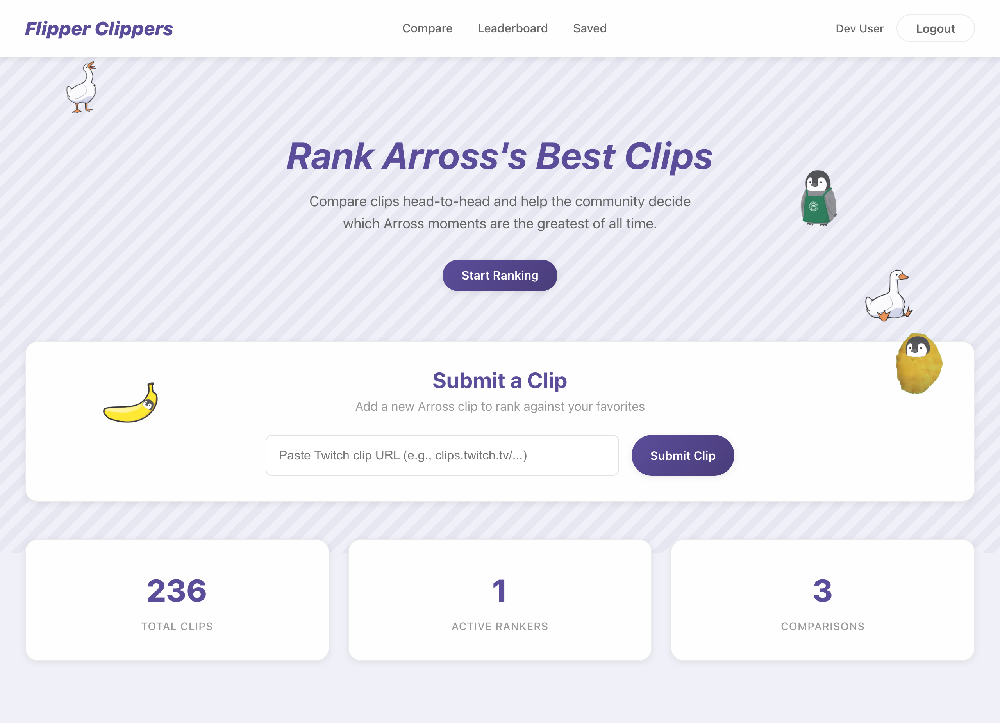
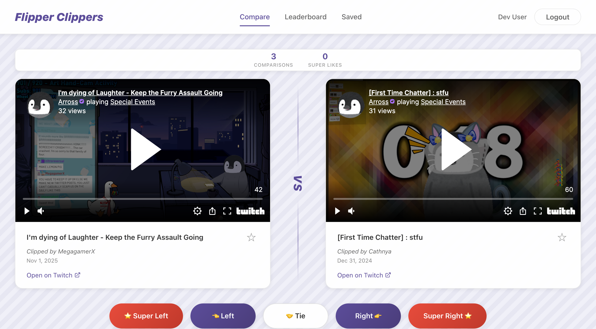
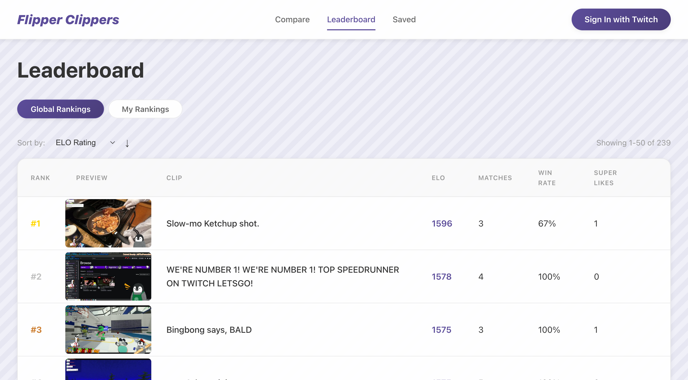
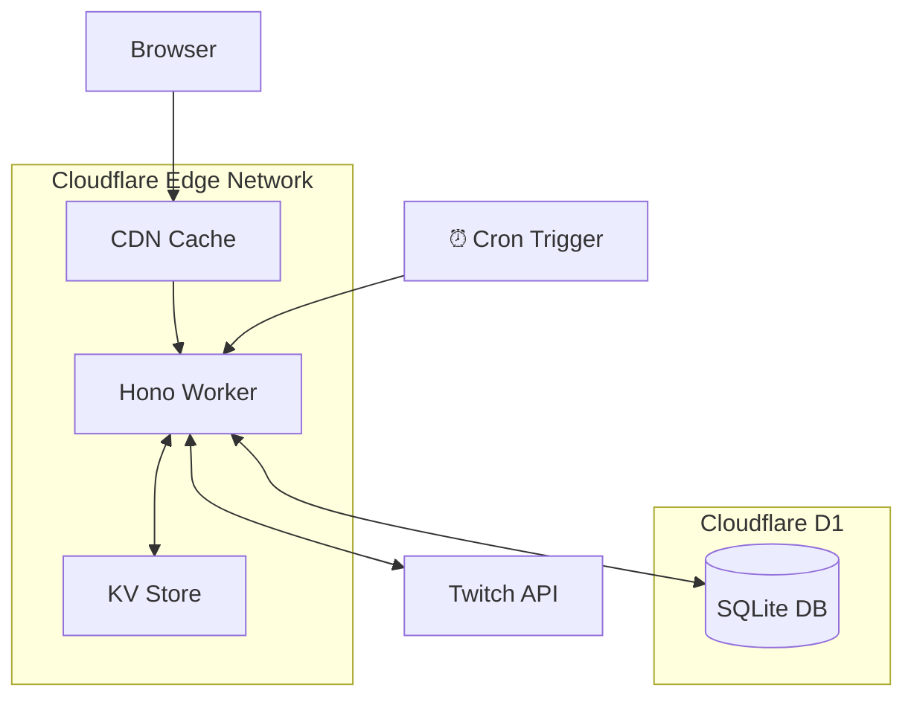

# Flipper Clippers

A Tinder-style clip ranking app for comparing and ranking Twitch clips. Users vote on pairs of clips to build personal and global leaderboards using an ELO rating system.

**Live at: [flipper-clippers.arross.tv](https://flipper-clippers.arross.tv)**

## Screenshots

### Homepage


### Compare Clips


### Leaderboard


## Architecture



### Serverless-First Design

This app is optimized for edge computing on Cloudflare's global network:

- **Edge Computing**: Runs on Cloudflare Workers at 300+ locations worldwide for low-latency responses
- **Multi-Layer Caching**: CDN caching for API responses, KV for sessions and thumbnails
- **D1 Database**: SQLite-based serverless database with automatic replication
- **Cron Triggers**: Background aggregation of global rankings runs every 5 minutes
- **Cookie-Based Batching**: Pre-calculates comparison pairs to minimize database queries

## Features

- **Pairwise Comparison**: Vote on which clip is better, Tinder-style
- **ELO Rating System**: Clips are ranked using a modified Glicko-style rating system
- **Personal & Global Leaderboards**: See your own rankings vs. the community consensus
- **Super Likes**: Mark your absolute favorite clips
- **Save Clips**: Build a personal collection of favorites
- **Twitch OAuth**: Sign in with your Twitch account
- **Smart Pairing**: Algorithm prioritizes showing unseen clips for full coverage

## Tech Stack

- **Runtime**: Cloudflare Workers
- **Framework**: [Hono](https://hono.dev/) - Ultrafast web framework
- **Database**: Cloudflare D1 (SQLite)
- **Auth**: Twitch OAuth 2.0
- **Frontend**: Vanilla JS with Twitch embed player

## Development

### Prerequisites

- Node.js 18+
- [Wrangler CLI](https://developers.cloudflare.com/workers/wrangler/)
- Cloudflare account
- Twitch Developer Application

### Setup

1. Clone the repository:
   ```bash
   git clone https://github.com/DigiBugCat/flipper-clippers.git
   cd flipper-clippers
   ```

2. Install dependencies:
   ```bash
   npm install
   ```

3. Create a D1 database:
   ```bash
   wrangler d1 create clip-ranker-db
   ```

4. Update `wrangler.toml` with your database ID

5. Create `.dev.vars` for local secrets:
   ```
   TWITCH_CLIENT_SECRET=your_twitch_client_secret
   SESSION_SECRET=your_session_secret
   ```

6. Run database migrations:
   ```bash
   npm run db:migrate:local
   ```

7. Import clips (optional):
   ```bash
   node scripts/generate-import-sql.js path/to/clips.csv
   wrangler d1 execute clip-ranker-db --local --file=scripts/import-clips.sql
   ```

8. Start development server:
   ```bash
   npm run dev
   ```

### Deployment

1. Set production secrets:
   ```bash
   echo "your_secret" | wrangler secret put TWITCH_CLIENT_SECRET
   echo "your_secret" | wrangler secret put SESSION_SECRET
   ```

2. Run production migrations:
   ```bash
   wrangler d1 execute clip-ranker-db --remote --file=src/db/schema.sql
   ```

3. Deploy:
   ```bash
   npm run deploy
   ```

## CSV Format for Clip Import

```csv
Title,Uploader,Date,URL
"Clip Title","ClipperName",20241231,https://www.twitch.tv/channel/clip/ClipSlug
```

## API Endpoints

| Endpoint | Description |
|----------|-------------|
| `GET /api/compare/next` | Get next pair to compare |
| `POST /api/compare/vote` | Submit a vote |
| `GET /api/leaderboard` | Global leaderboard |
| `GET /api/leaderboard/me` | Personal leaderboard |
| `POST /api/aggregate` | Trigger global ranking aggregation |

## License

MIT License - see [LICENSE](LICENSE) file for details.
