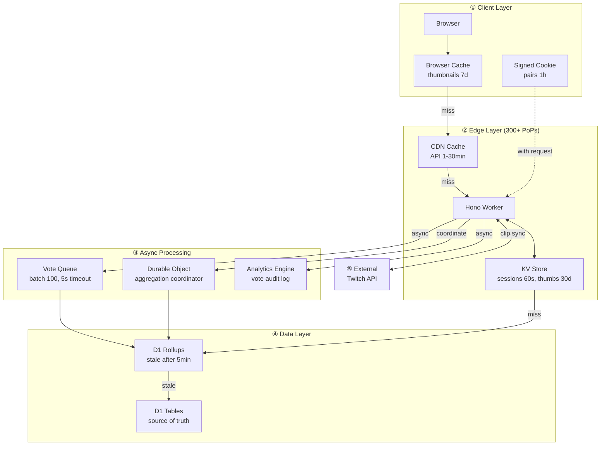

# Flipper Clippers

A "This or That" clip ranking app - vote on pairs of Twitch clips to build personal and global leaderboards using an ELO rating system.

**Live at: [flipper-clippers.arross.tv](https://flipper-clippers.arross.tv)**

## Screenshots

### Homepage


### Compare Clips


### Leaderboard


## Architecture



### Serverless-First Design

Optimized for edge computing with multi-layer caching:

| Layer | What's Cached | TTL | Purpose |
|-------|--------------|-----|---------|
| **Browser** | Thumbnails | 7 days | Eliminate repeat image fetches |
| **Cookie** | Next 10 clip pairs | 1 hour | Reduce pairing queries by 10x |
| **CDN** | API responses | 1-30 min | Edge-cached leaderboards & clip data |
| **KV** | Sessions | 60s | Skip auth DB lookups |
| **KV** | Thumbnails | 30 days | Cache Twitch images at edge |
| **D1** | Rollup tables | 5 min staleness | Pre-aggregated global rankings |

**Key optimizations:**
- **Async Vote Processing**: Votes enqueued for batch processing, reducing response latency to ~50ms
- **Lazy Aggregation**: Global rankings recalculate only on cache miss, not on a schedule
- **Incremental Rollups**: Each vote updates rollup sums immediately (2 queries vs full recalc)
- **Cookie-Based Batching**: Pre-calculates 10 comparison pairs per batch, HMAC-signed to prevent tampering
- **Session Caching**: KV lookup before D1, reducing auth overhead from 2 queries to 0 on cache hit
- **Durable Object Coalescing**: Prevents duplicate aggregation when multiple requests hit simultaneously
- **Smart Placement**: Worker runs closer to D1 database for reduced latency

### Cache Flow Details

#### Vote Submission Flow
```
POST /api/compare/vote
  │
  ├── Auth Check ─────────────────────────────────────┐
  │     └── KV session:{id} lookup                    │ 0 D1 queries (80% of requests)
  │         └── miss? → D1 session + user lookup      │ 2 D1 queries (20% of requests)
  │
  ├── Vote Processing (sync, BATCHED) ────────────────┤
  │     ├── Get both clips (IN query)                 │ 1 D1 read (was 2)
  │     ├── Get user's ratings (IN query)             │ 1 D1 read (was 2)
  │     ├── Calculate ELO changes (in-memory)         │
  │     ├── Batch upsert user_clip_ratings            │ 1 D1 batch (was 2)
  │     ├── Record to Analytics Engine                │ 0 D1 (fire-and-forget)
  │     └── Enqueue vote for async processing         │ 0 D1 (non-blocking)
  │                                                   │
  └── Response returns in ~50ms ──────────────────────┤
                                                      │
  Queue Consumer (async, batched up to 100 votes):    │
        ├── Update clip_rating_rollups                │ 4 D1 ops per clip
        └── Batch update user stats & streaks         │ 1 D1 batch per user
                                                      │
TOTAL: ~3-5 D1 ops sync + deferred rollups ───────────┘
```

#### Leaderboard Flow (Stale-While-Revalidate)
```
GET /api/leaderboard
  │
  ├── KV Cache Check ──────────────────────────────────┐
  │     key: "leaderboard:{page}:{limit}:{sort}"       │
  │                                                    │
  ├── FRESH (age < 60s) ───────────────────────────────┤
  │     └── Return immediately                         │ 1 KV read, 0 D1 queries
  │         └── Header: X-Cache: HIT                   │
  │                                                    │
  ├── STALE (age 60-120s) ─────────────────────────────┤
  │     ├── Return stale data immediately             │ User sees response in <50ms
  │     └── Background refresh (waitUntil):            │
  │           └── Durable Object coordinates           │
  │               └── Aggregation (if cooldown passed) │ 3-10 D1 queries (async)
  │         └── Header: X-Cache: STALE                 │
  │                                                    │
  └── MISS (age > 120s or first request) ──────────────┤
        ├── Durable Object triggers aggregation        │
        │     └── Check rollup freshness               │ 1 D1 read
        │     └── Get all clips                        │ 1 D1 read
        │     └── Get all user ratings                 │ 1 D1 read
        │     └── Update clips table (batched)         │ N D1 writes
        ├── Query fresh leaderboard                    │ 1 D1 read
        └── Store in KV, return                        │ 1 KV write
            └── Header: X-Cache: MISS                  │
                                                       │
MISS cost: 10+ D1 ops, 500-1000ms ─────────────────────┘
```

#### Durable Object Role (Aggregation Coordinator)
```
Purpose: Prevent duplicate expensive aggregations

Without DO:
  10 users hit /leaderboard simultaneously (cache miss)
  → 10 parallel aggregations = 100+ D1 queries (wasted)

With DO:
  10 users hit /leaderboard simultaneously (cache miss)
  → All requests route to single DO instance
  → First request triggers aggregation
  → Other 9 requests wait and share the result
  → 1 aggregation = 10 D1 queries (10x savings)

Cooldown: 30 seconds between aggregations
Instance: Single global instance (idFromName('global'))
```

### Cost Estimates (Paid Plan)

| Operation | D1 Ops | KV Ops | Queue | Approx Cost |
|-----------|--------|--------|-------|-------------|
| Vote (cached auth) | 3-5 | 1 | 1 | ~$0.000002 |
| Leaderboard (KV hit) | 0 | 1 | 0 | ~$0.0000005 |
| Leaderboard (SWR stale) | 10 | 2 | 0 | ~$0.000003 |
| Leaderboard (full miss) | 15+ | 1 | 0 | ~$0.00001 |
| Auth check (KV hit) | 0 | 1 | 0 | ~$0.0000005 |
| Next pair (cookie batch) | 2 | 0 | 0 | ~$0.000002 |

**Expected monthly cost at high activity (10K votes/day):** $3-7/month

## Features

### Core
- **Pairwise Comparison**: Vote on which clip is better in head-to-head matchups
- **ELO Rating System**: Clips are ranked using a modified Glicko-style rating system
- **Personal & Global Leaderboards**: See your own rankings vs. the community consensus
- **Super Likes**: Mark your absolute favorite clips
- **Save Clips**: Build a personal collection of favorites
- **Twitch OAuth**: Sign in with your Twitch account
- **Smart Pairing**: Algorithm prioritizes showing unseen clips for full coverage

### Clipdle
A daily "guess the higher ELO" game (like Wordle for clips). Each day presents 8 rounds where you pick which clip has the higher community rating. Share your score and compete with friends.

**Live at: [clipdle.arross.tv](https://clipdle.arross.tv)**

### Social
- **Taste Compatibility**: See how your clip preferences match with other users
- **Similar Users**: Find people with similar taste in clips
- **Public Profiles**: Share your top-rated clips and comparison stats
- **Shareable Links**: Generate links to share your profile or top 5 clips

### Activity Feed
- **Global Feed**: See public activity (votes, super likes, comments) from all users
- **Trending Clips**: Discover clips gaining traction over 24h, 7d, or 30d periods
- **Comments & Reactions**: Add emoji reactions and text comments to clips

## Tech Stack

- **Runtime**: Cloudflare Workers
- **Framework**: [Hono](https://hono.dev/) - Ultrafast web framework
- **Database**: Cloudflare D1 (SQLite)
- **Caching**: KV for sessions & thumbnails, CDN for API responses
- **Queues**: Cloudflare Queues for async vote processing
- **Durable Objects**: Aggregation coordination to prevent duplicate work
- **Analytics**: Analytics Engine for vote audit logs
- **Auth**: Twitch OAuth 2.0
- **Frontend**: Vanilla TypeScript with Twitch embed player
- **Clip Sync**: Automated daily sync from Twitch API via cron

## Development

### Prerequisites

- Node.js 18+
- [Wrangler CLI](https://developers.cloudflare.com/workers/wrangler/)
- Cloudflare account
- Twitch Developer Application

### Setup

1. Clone the repository:
   ```bash
   git clone https://github.com/DigiBugCat/flipper-clippers.git
   cd flipper-clippers
   ```

2. Install dependencies:
   ```bash
   npm install
   ```

3. Create a D1 database:
   ```bash
   wrangler d1 create clip-ranker-db
   ```

4. Update `wrangler.toml` with your database ID

5. Create `.dev.vars` for local secrets:
   ```
   TWITCH_CLIENT_SECRET=your_twitch_client_secret
   SESSION_SECRET=your_session_secret
   ```

6. Run database migrations:
   ```bash
   npm run db:migrate:local
   ```

7. Start development server:
   ```bash
   npm run dev
   ```

### Deployment

1. Set production secrets:
   ```bash
   echo "your_secret" | wrangler secret put TWITCH_CLIENT_SECRET
   echo "your_secret" | wrangler secret put SESSION_SECRET
   ```

2. Run production migrations:
   ```bash
   wrangler d1 execute clip-ranker-db --remote --file=src/db/schema.sql
   ```

3. Deploy:
   ```bash
   npm run deploy
   ```

## API Endpoints

### Compare
| Endpoint | Description |
|----------|-------------|
| `GET /api/compare/next` | Get next pair to compare |
| `POST /api/compare/vote` | Submit a vote |

### Leaderboard
| Endpoint | Description |
|----------|-------------|
| `GET /api/leaderboard` | Global leaderboard |
| `GET /api/leaderboard/me` | Personal leaderboard |

### Feed & Social
| Endpoint | Description |
|----------|-------------|
| `GET /api/feed/global` | Global activity feed |
| `GET /api/feed/trending` | Trending clips by period |
| `GET /api/social/profile/:userId` | Public user profile |
| `GET /api/social/compatibility/:userId` | Taste compatibility score |
| `GET /api/social/similar` | Find users with similar taste |

### Comments
| Endpoint | Description |
|----------|-------------|
| `GET /api/comments/:clipId` | Get clip comments |
| `POST /api/comments/:clipId` | Add comment or reaction |
| `GET /api/comments/reactions/:clipId` | Get reaction counts |

### Share
| Endpoint | Description |
|----------|-------------|
| `POST /api/share/create` | Generate shareable link |
| `GET /api/share/:token` | View shared content |
| `GET /api/share/my-links` | List your share links |

### Clipdle
| Endpoint | Description |
|----------|-------------|
| `GET /api/clipdle/today` | Get today's seed |
| `GET /api/clipdle/game` | Start game with seed |
| `GET /api/clipdle/round` | Get round clips |
| `GET /api/clipdle/reveal` | Reveal ELOs after guess |

## License

MIT License - see [LICENSE](LICENSE) file for details.
